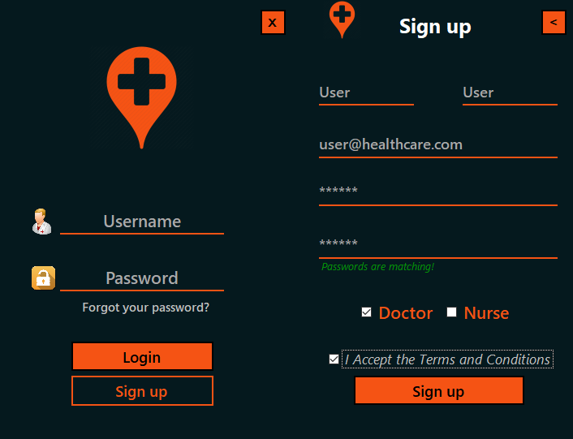
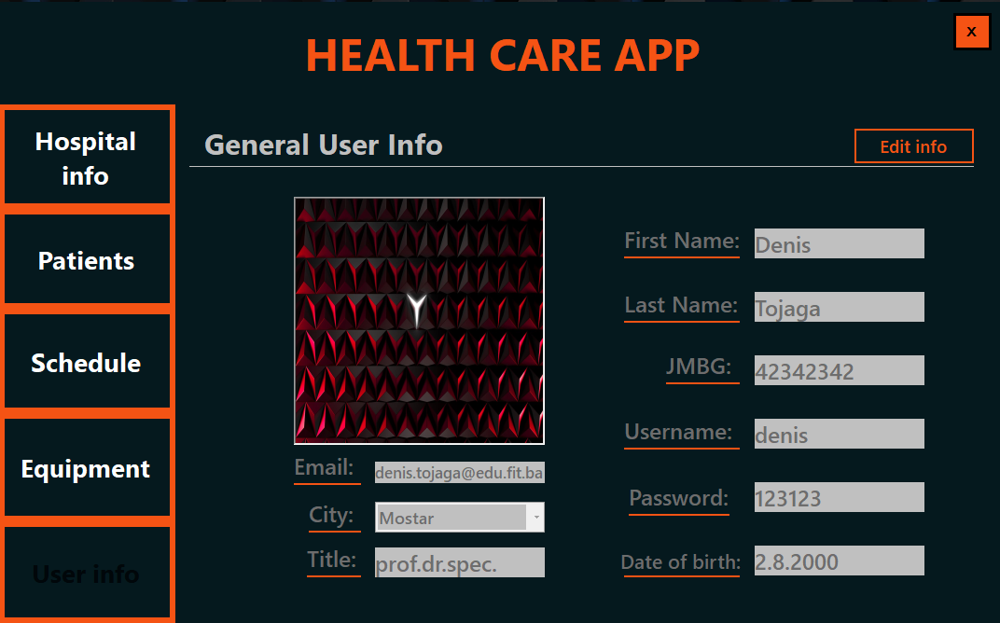

# HealthCare_System_Demo
 

### Technologies used

- C#
- SQLite

# About HealthCareApp

Represents work of one hospital in real life. User can work in two mods - doctor and nurse -, where they have their own manipulation restrictions.
From the navbar on the left user can open all main forms of the app.

# Login form

#### Login form with modern UI, containing the sign in form which  is shown by the transition on clicking SignUp button.
 

# Hospital 

#### Here the doctor can edit main description of the hospital, including its place on Maps, name and email

# Patients

#### Lets a doctor to have a clear view of all patients currently in the hospital, user can either add new ones, view existing ones and release patients after their health is improved.

# Schedule

#### Represents doctor's schedule for certain day, user can go back and forward to have a view of all schedules while he was working.He can add examinations where the new form shows up for him to enter all needed data.
#### At the bottom he can have a daily review shown as a report, which can be printed in A4 format.

# Equipment 

#### Shows all equipment in stock, at the end of the day user doesn't have to do inventory , because he is able to remove spent equipment for that day.
#### There is also an option for him to order new set of it by maximum of 20 pieces.

# User info

#### Shows all details about currently logged user where he can update and edit all of his data.

